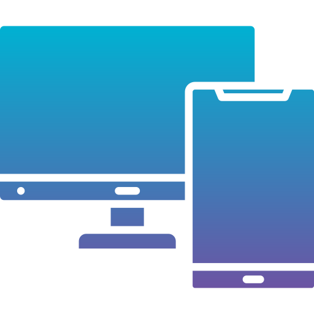
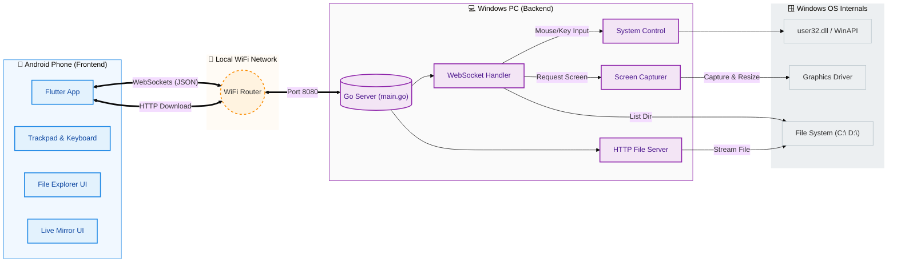

# DeskLink 📱💻
> **Control your PC from your Phone via WiFi.**

**DeskLink** is a powerful, open-source tool that turns your Android phone into a seamless remote control for your Windows PC. Whether you want to view your screen in real-time, browse files from your bed, manage running apps, or use your phone as a trackpad/keyboard, DeskLink makes it instant and easy.

<p align="center">
  
</p>


---

## ✨ Key Features

* **📺 Live Screen Mirroring:** View your PC screen on your phone in real-time. Supports landscape mode, full-screen immersion, and touch interactions.
* **📂 Remote File Explorer:**
    * Browse all drives (C:\, D:\, etc.) and folders.
    * Open on PC: Tap to launch files directly on your computer.
    * Download to Phone: Tap the download icon to view PC files (images, videos, PDFs) directly on your mobile device.
* **📱 App Manager:** View all running desktop applications. Switch focus to an app or Kill/Force Close unwanted programs remotely.
* **🖱️ Zero-Latency Trackpad:** Smooth mouse movement with Left & Right click support.
* **⌨️ Real-Time Keyboard:** Type on your phone, see it appear instantly on your PC (Emoji supported! 😀).
* **📋 Clipboard Sync:** Copy text on PC → Paste on Phone (and vice versa).
* **🎛️ Media Controls:** Volume Up/Down, Mute, Play/Pause.
* **🚀 One-Tap Shortcuts:** Open YouTube, Netflix, Calculator, Notepad, or Lock Screen instantly.
* **📊 System Monitor:** View your PC's real-time CPU & RAM usage on your phone.
* **🔒 Secure & Local:** Runs entirely on your local WiFi. No data leaves your room.

---
## 🏗️ System Architecture



## 🛠️ Technology Stack

* **Frontend (Mobile App):** [Flutter](https://flutter.dev/) (Dart) - Beautiful, cross-platform UI.
* **Backend (PC Server):** [Go](https://go.dev/) (Golang) - High-performance, low-level system control.
* **Communication:** WebSockets (Real-time, bidirectional data sync).
* **System API:** Windows `user32.dll` for native hardware input simulation.

---

## 🚀 Getting Started

### Prerequisites
1.  A **Windows PC** (Windows 10/11).
2.  An **Android Phone**.
3.  Both devices must be connected to the **Same WiFi Network**.

### 📥 Installation

#### 1. The PC App (Server)
1.  Download the latest `desklink.exe` from the [Releases](#) page.
2.  Double-click `desklink.exe` to run it.
3.  **Important:** If Windows Firewall asks, click **"Allow Access"** (Check both Private & Public networks).
4.  A black terminal window will open. Minimize it (Do not close it).

#### 2. The Android App (Client)
1.  Download and install the `app-release.apk` on your phone.
2.  Open the app.

---

## 🎮 How to Use

1.  **Find PC IP Address:**
    * On your PC, open Command Prompt (`cmd`) and type `ipconfig`.
    * Look for the **IPv4 Address** (e.g., `192.168.1.5`).
2.  **Connect:**
    * Enter this IP in the DeskLink mobile app and tap **Connect**.
3.  **Enjoy:**
    * **Live Control:** Tap "Screen" to view your monitor. Rotate phone for full-screen landscape mode. Drag finger to move mouse, use buttons to click.
    * **Files:** Browse drives. Tap a file name to open on PC, or the Blue Download Icon to view it on your phone.
    * **Remote Tab:** Use shortcuts like Calc, YouTube, Volume.
    * **Trackpad Tab:** Move cursor, tap to click, hold for right-click. Type in the text box for keyboard input.
    * **Stats Tab:** Monitor your PC's health.

---

## 🧑‍💻 Developer Setup (Build from Source)

If you want to modify the code or contribute, follow these steps.

### Backend (Go)
```bash
cd backend
# Install dependencies
go mod tidy
# Run normally
go run cmd/server/main.go
# OR Build .exe
go build -o desklink.exe cmd/server/main.go

```

### Frontend (Flutter)
```bash
cd frontend
# Install dependencies
flutter pub get
# Run on emulator/device
flutter run
# Build APK
flutter build apk --release
```

## 📄 License
This project is licensed under the MIT License - see the LICENSE file for details.


Made with ❤️ by [Kunal]


